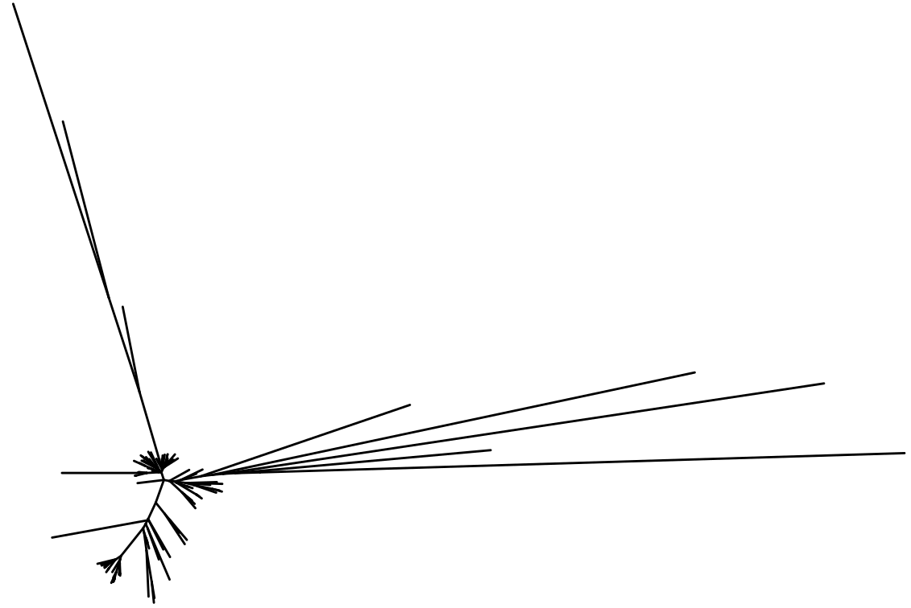
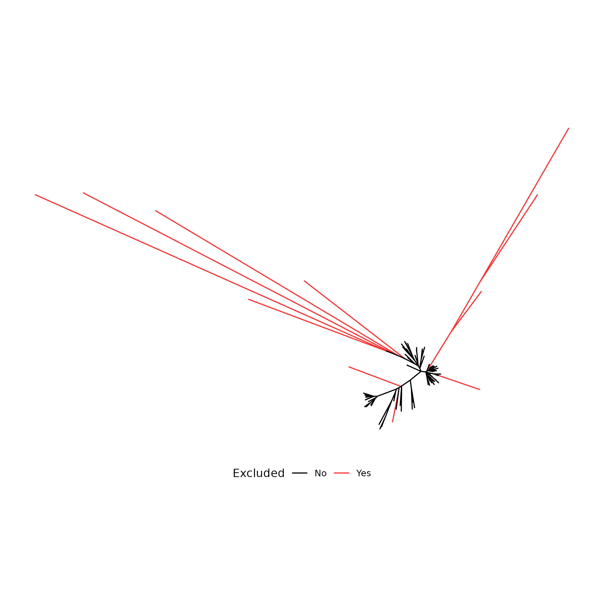
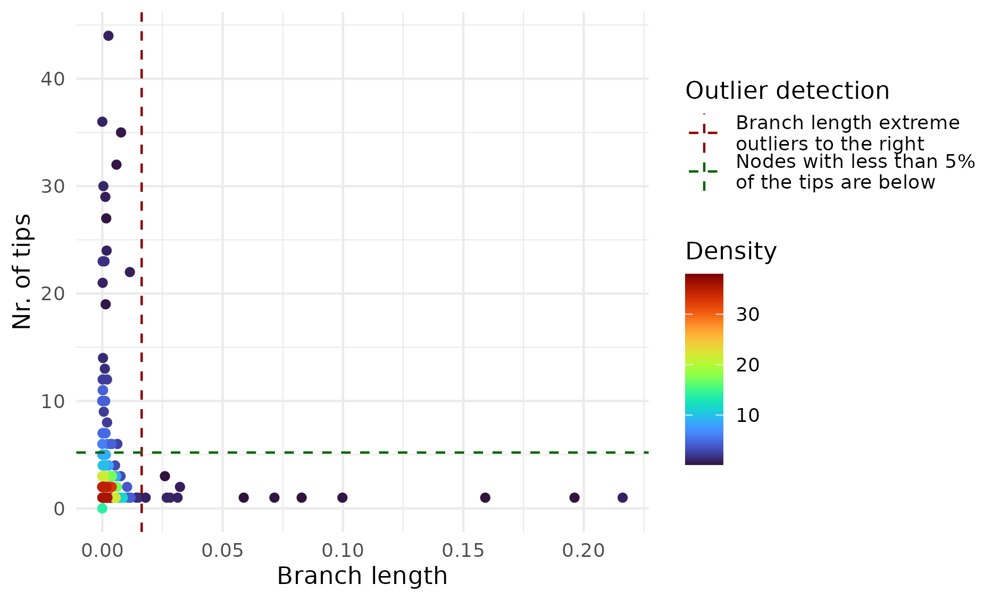
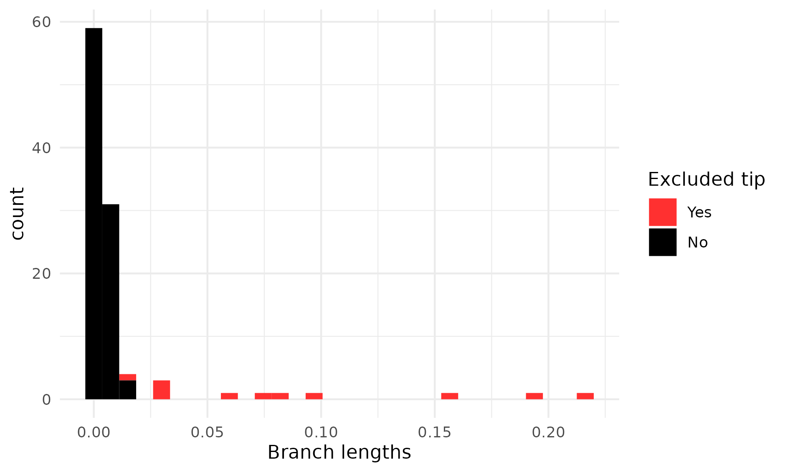

# IQR Tree Pruner

The aim of the *R* script is to exclude extremely long branches -- representing potentially misclassified taxa or genomic regions with undetected recombinant parts -- from a phylogenetic tree.

## Running the code

```         
Rscript iqr_tree_pruner_v1.0.R --original_tree tree.nwk --tipprop 0.05
```

***Be aware that running the script is going to delete all previously created output files in the working directory.***

## Citation

Please cite the IQR Tree Pruner if it was helpful for your research. This will allow me to
continue maintaining this project in the future.

> Ari, E. (2023). IQR Tree Pruner, (Version 1.0) [Computer software] [DOI: 10.5281/zenodo.8220477](https://doi.org/10.5281/zenodo.8220477).

## Required R packages

[optparse](https://cran.r-project.org/web/packages/optparse/index.html), [tidyverse](https://www.tidyverse.org/), [magrittr](https://magrittr.tidyverse.org/), [caper](https://cran.r-project.org/web/packages/caper/index.html), [treeio](https://bioconductor.org/packages/release/bioc/html/treeio.html) (Bioconductor), [MASS](https://cran.r-project.org/web/packages/MASS/index.html), [phytools](https://cran.r-project.org/web/packages/phytools/index.html), [viridis](https://cran.r-project.org/web/packages/viridis/index.html), [ggtree](https://bioconductor.org/packages/release/bioc/html/ggtree.html) (Bioconductor)

## Inputs and outputs

### Input file and argument

-   required:
    -   `--original_tree`: a NEWICK tree file
-   optional argument:
    -   `--tipprop`: The proportion of tips on a single branch that can be excluded based on the upper fence of the IQR of branch lengths.The default value is 0.05 (5%).

### Outputs files

-   **pruned.nwk**: the pruned NEWICK tree file

-   **branch_length_nr_of_tips.png**: a scatter plot of branch lengths and number of tips with the IQR upper fence and the proportion of tips gave by the `--tipprop` argument

-   **branch_length_distribution.png**: a histogram of branch lengths indicating the count of included and excluded tips

-   **original_vs_pruned_tree.png**: a tree plot indicating the pruned tip branches

-   **tree_pruning.log**: a text file containing the summary comparison of the original tree and the pruned tree, and the R session info.

## The IQR pruning algorithm

Abbreviations:

-   *IQR*: the upper fence of the *Inter Quartile Range* of a vector: Q3 + 3 \* (Q3 - Q1) = extreme outlier threshold

-   *R2T*: root-to-tip distance on a midpoint rooted tree

1<sup>st</sup> part: Pruning the unrooted tree based on the upper fence of *IQR* branch lengths.

1.  Calculating the minimum number of tips for each branch (unrooted bifurcating tree, both directions are looked up, than the least tip number is chosen to represent the branch).

2.  Calculating the *IQR* for branch lengths.

3.  Excluding those extreme outlier branches containing less than 0.05 (or a given) proportion of the tips.

2<sup>nd</sup> part: Pruning the midpoint rooted tree based on root-to-tip distances.

Excluding tips based on the *R2T* *IQRs*, while iteratively midpoint rooting and excluding the top gretaest extreme outlier.

4.  Midpoint rooting the tree (after pruning with method described in the 1<sup>st</sup> part).

5.  Calculating the *IQR* for root-to-tip distances.

6.  Excluding the most extreme outlier tip based on the *IQR* for root-to-tip distances.

7.  Repeating point 4. to 6. till there are no more extreme outlier *IQR* tip is found.

8.  Unrooting the pruned tree.

## Let's see an example

A tree with some extremely long branches:



We have tried to prune the tree with the [Treeshrink](https://github.com/uym2/TreeShrink) software (v1.3.9; Mai & Mirarab, 2018) but no tip was removed, so the extreme long branches still remained.

Therefore, we applied the [IQR Tree Pruner](https://github.com/barizona/iqr_tree_pruner) R script (v1.0) with which the following branches were pruned:



Here you can see the distribution of the branch length and number of tips of the original tree:



Where the branches to the right of the dark red line and below the dark green line were pruned during the 1<sup>st</sup> part of the algorithm.

Here is the histogram of tip branch lengths:



## References

Mai,U. and Mirarab,S. (2018) [TreeShrink: fast and accurate detection of outlier long branches in collections of phylogenetic trees.](https://bmcgenomics.biomedcentral.com/articles/10.1186/s12864-018-4620-2) *BMC Genomics*, 19, 272.
